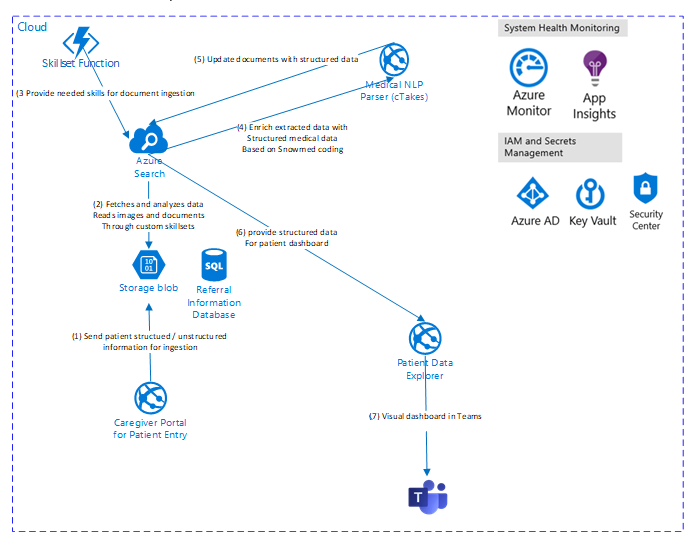
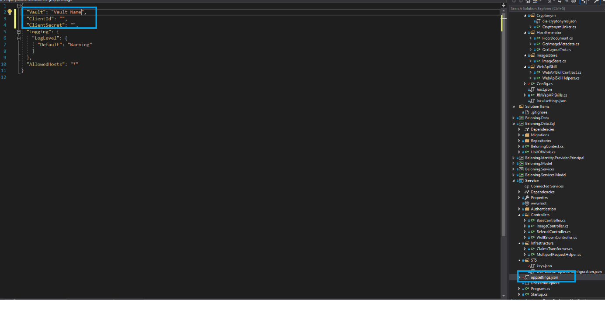
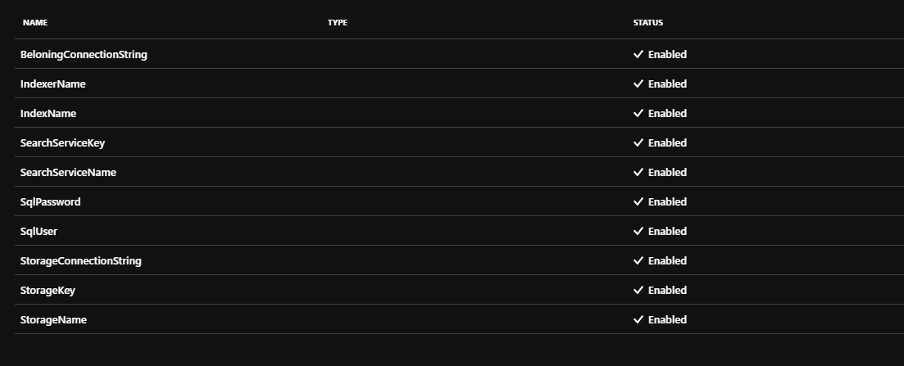
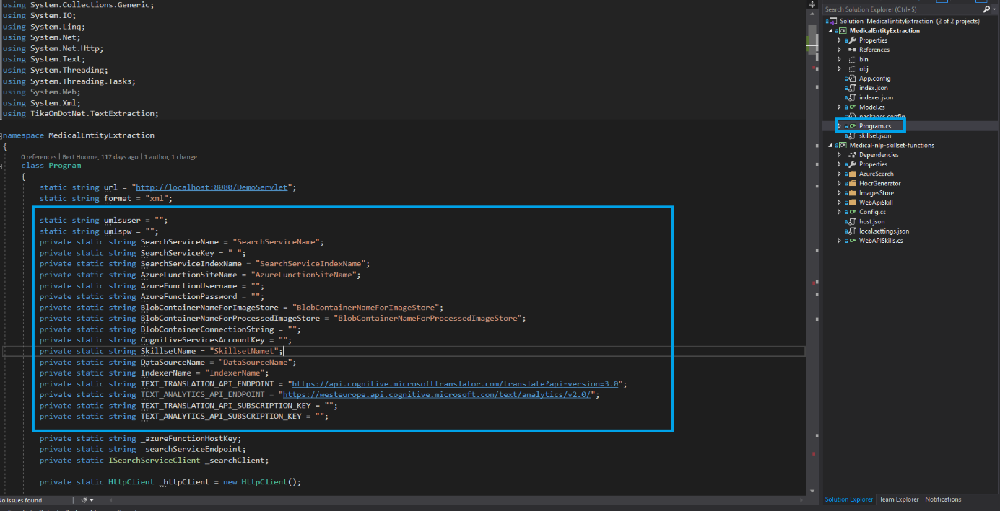
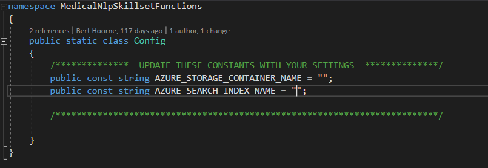
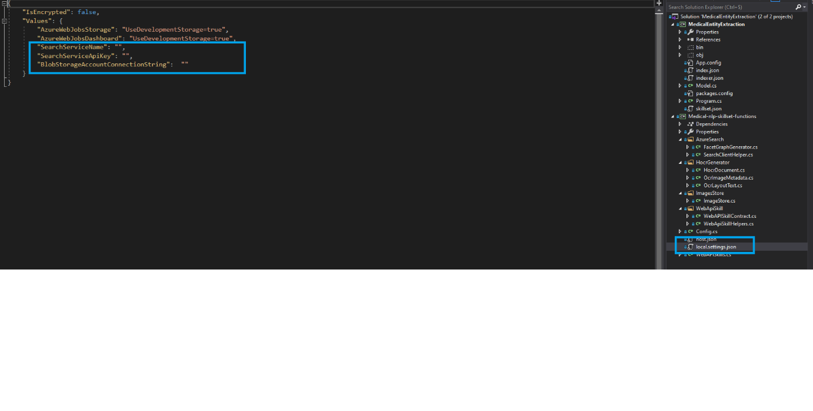
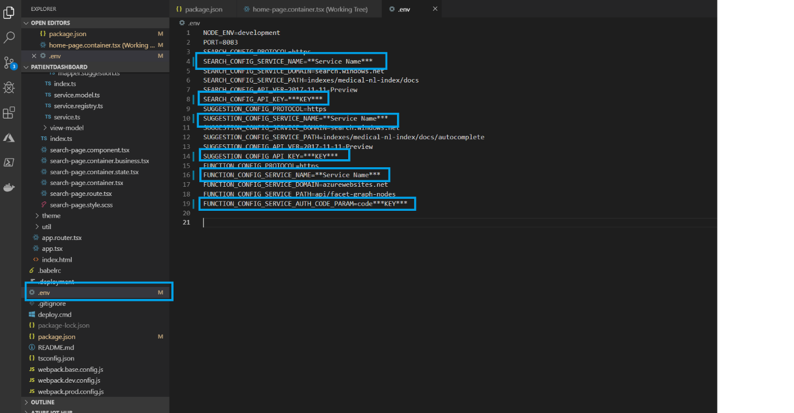

# medical-nlp-dashboard
## Technical Overview

The current Proof of Concept architecture is shown below.

This is based on following repositories and extended documentation can be found there

[JFK Files Github](https://github.com/microsoft/AzureSearch_JFK_Files/blob/master/README.md)

[How To Build a Medical Document Search Application](https://github.com/Azure-Samples/search-dotnet-medical-ner/blob/master/README.md)






The solution consists out of following parts: 


1.  **Patient Data Explorer** : The patient data explorer gives caregivers a way to search into unstructured data and potentially find relevant relations. The goal of the data explorer is to provide the tools for the caregiver to find the needed information faster and in a more accurate way.

2. **Caregiver Entry Portal** : The Caregiver Entry Portal allows users to easily upload referral information into the system. The portal consists out of an easy-to-use wizard, that gathers patient information. This data will then be processed by the Azure Search engine

3. **Search Engine** : The data engine consists out of an Azure Search engine, an open source medical NLP engine (cTakes), combined with several A.I. skills. Some examples of these skills are Object Content Recognition (OCR), Language detection, Translations, NLP, … (SNOWMED – ICD10)

# How To 

##### Portal Service

Set the credentials for the key vault (for offline debugging)


 
The Keyvault has following Keys:



Fill In all the needed fields for the medical extraction, located in MedicalEntityExtraction project in the Program Class


Update the Config settings for the Azure Function skillset




If you want to run the Azure Function Skillset locally, fill in the local.settings.json file

__
##### Patient Dashboard (Search portal)

Change config settings here:







